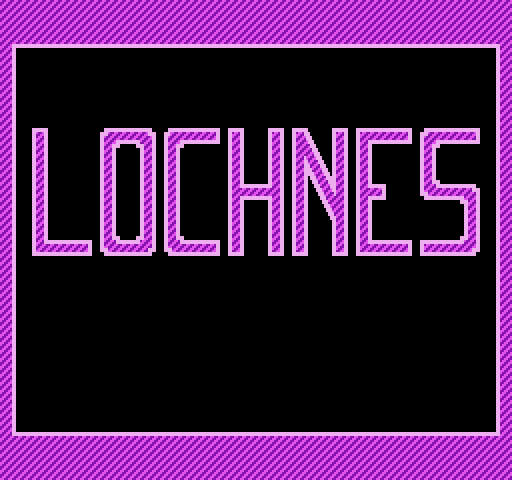

# Lochnes



This is a toy NES emulator in Rust, which uses generators for control flow. I wrote a blog post going over some of the implementation details here: https://kyle.space/posts/i-made-a-nes-emulator/

**NOTE:** Lochnes uses nightly features! The project is pinned to a specific working nightly version of Rust in `rust-toolchain.toml`. Rustup should ensure that an appropriate version of Rust is installed when building or running the project from the repo root.

## Compatibility

Compatibility is very poor! It doesn't support audio output, scrolling, or most NES ROM mappers. Games that use the NROM or UXROM mappers should be loadable, and games that don't use scrolling should be mostly playable.

## Usage

You'll need to install SDL2 before using Lochnes (see the README for [`rust-sdl2`](https://github.com/Rust-SDL2/rust-sdl2) for different installation options based on on your platform)

Lochnes can be started with:

```sh-session
$ cargo run --release -- rom.nes
```

Or, if you want to use a bundled version of SDL2:

```sh-session
$ cargo run --features sdl2/bundled --release -- rom.nes
```

If 256×240 is too small for you, use `--scale` to make the window bigger:

```sh-session
$ cargo run --release -- rom.nes --scale=3
```

If you want debug output, pass `-v` multiple times (warning: 5 v's makes everything really slow, don't even bother with 6)

```sh-session
$ cargo run --release -- rom.nes -vvvvv
```

## Controls

Input bindings is not currently customizable, so here are the current input bindings:

- **Exit**: \[Esc\]
- **A**: \[Z\], (Xbox: A)
- **B**: \[X\], (Xbox: B or X)
- **Start**: \[Return\], (Xbox: Start)
- **Select**: \[\\\] (Backslash key), (Xbox: Back)
- **Up**/**Down**/**Left**/**Right**: \[⇧\]/\[⇩\]/\[⇦\]/\[⇨\] (Arrow keys), (Xbox: D-pad)

## License

Licensed under the MIT license
